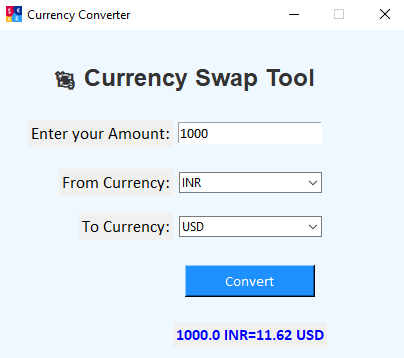

# 💱 Currency Converter (GUI + API)

A beginner-friendly Python app to convert currencies in real-time using a graphical interface built with *Tkinter* and *ExchangeRate API*. It allows users to select currencies and convert instantly with live rates fetched from the internet.

---

## 🖥 Features

- Simple Tkinter-based GUI
- Select any base and target currency
- Real-time conversion using API
- Clean and beginner-friendly code
- Error handling for invalid inputs

---

## 🚀 How It Works

1. User selects *From* and *To* currency from dropdown (ComboBox).
2. Enters the amount to convert.
3. On clicking *Convert, the app fetches **live exchange rate* from API.
4. Displays the converted amount instantly on the GUI.

---

## 🧰 Tech Stack

- *Python 3*
- *Tkinter* (for GUI)
- *requests* module (for API requests)
- *ExchangeRate API*  
  *(https://www.exchangerate-api.com/)*

---

## 📸 Screenshot

